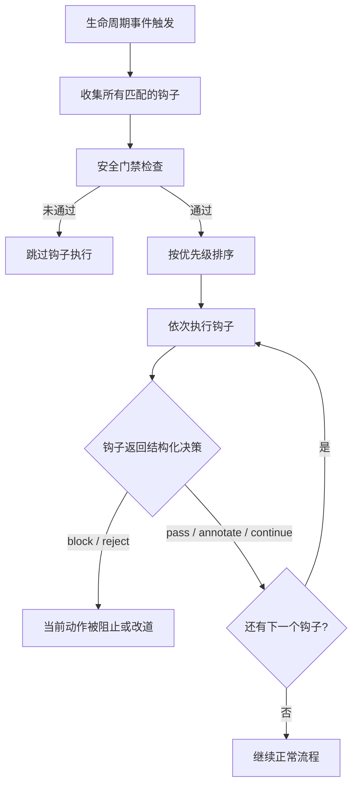
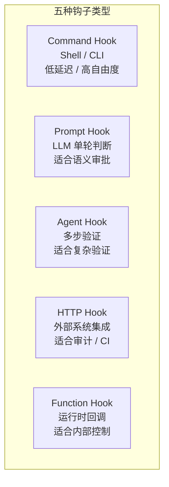
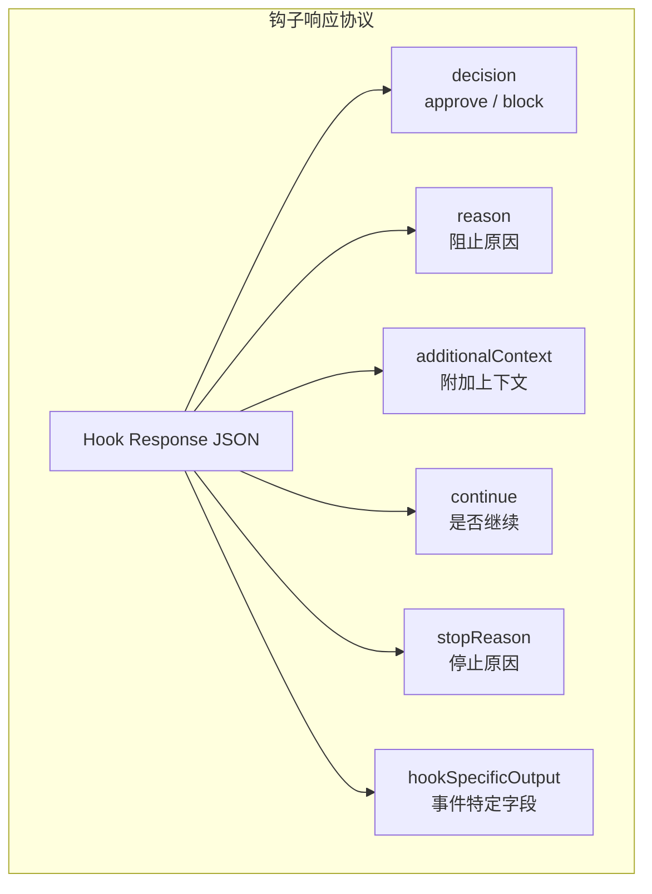
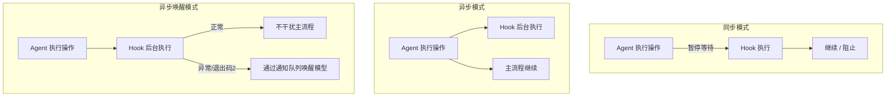

这篇文章的很多思考，最初来自我读 **Claude Code Book** 里关于 hooks 的那一章，以及我自己在做 code agent 时一路遇到的问题。前者让我第一次把 hooks 这件事从“扩展脚本”理解成“生命周期扩展点系统”，后者则逼着我不断去追问：一个真正可演进的 code agent，到底要不要有 hooks，如果要有，它应该长成什么样。

我的实训项目源地址：[1024xengineer.github.io/neo-code/](https://1024xengineer.github.io/neo-code/)

**一个基于 Golang 的 `CLI agent`，欢迎体验和 `issue`。**

如果说 permission 是 Agent 的护栏，workflow 是骨架，tool 是手脚，那么 hooks 更像是一层遍布全身的“神经系统”。

它不直接承担主逻辑，却决定了系统能否在关键节点被观察、被拦截、被增强、被校正。它让一个原本只能不断往 runtime 主循环里堆判断的系统，慢慢长出一种更优雅的演进能力：主链路保持收敛，变化逻辑有处安放，产品能力也不必总是依赖改源码。

我想写这篇文章，不是为了把 hooks 包装成某个花哨功能，而是想认真回答一个问题：

> 对于 code agent 来说，hooks 到底是什么？它为什么重要？以及如果从头开始做，一套好的 hooks 系统应该怎么长出来？

---

## hooks 是什么：它不是脚本入口，而是生命周期上的扩展点

很多人第一次听到 hooks，会下意识把它理解成“给用户执行一段脚本的入口”或者“某个产品的插件能力层”。这当然不算错，但如果只停在这个层面，其实会把 hooks 想窄。

在我看来，hooks 首先不是一个产品按钮，而是一种**系统内部扩展机制**。更准确一点说：

> hooks 是 runtime 生命周期关键节点上的扩展点机制。它允许系统在固定时机插入额外逻辑，用于观察、拦截、附加判断、补充上下文、记录信息或增加 guard。

这里最重要的词有两个：**固定时机** 和 **额外逻辑**。

它不是“我想在哪跑点逻辑就在哪跑”，而是挂在有限的生命周期事件上；它也不是“第二套 runtime”，不是再造一个主流程层。它做的是主逻辑之外的事：给系统在关键节点加一层可插拔、可收敛、可观测的判断与增强。

我现在更喜欢把它理解成一层 **middleware / extension layer**。不是新的业务模块，不是新的控制平面，而是在 runtime 执行过程中，为关键节点暴露一组扩展接口。

如果把这件事说得更直白一点：

> hooks 不是主逻辑本身，而是主逻辑运行过程中的扩展接口。

---

## 为什么 code agent 迟早会需要 hooks

一个 agent 在很早期的时候，其实不太会强烈感受到 hooks 的必要性。那时候系统还很简单，很多需求直接写在 run loop 里就行：收到用户输入，调模型，执行 tool，收工具结果，再调模型，最后结束。哪怕多几层判断，主循环也还能撑得住。

但一旦 agent 复杂起来，hooks 的必要性会迅速浮出来。

因为你会不断遇到这种逻辑：

- tool 调用前，检查这次操作是不是高风险
- tool 返回后，补一段审计或结果摘要
- final 前，再跑一轮 verify，别让模型凭一句“我完成了”就结束
- step 结束后，统计 token、写 telemetry、决定是否 compact
- 权限判断前，补充更细的上下文或风险标签
- 子代理结束后，检查结果是否真的能进入主流程
- 上下文压缩前，把某些关键信息强行保留
- 会话结束时，做 checkpoint、做摘要、清理状态

这些逻辑都很真实，也都很合理。但它们有一个共同点：**不是主动作本身，却总是在某个时机必须发生。**

这就是 hooks 真正的切入点。

如果没有 hooks，这类逻辑只能继续写在 runtime 主链路里。时间一长，run loop 里就会堆满“顺手做一下”“这里加个判断”“这里再兜底一下”这种代码。最后系统不是不能跑，而是越来越难扩展、越来越难拆分、越来越难向别人解释。

所以 hooks 的第一个价值，其实不是“给用户更多自由”，而是：

> **把 runtime 中那些依赖固定时机触发、但不应继续硬编码在主循环里的附加逻辑，解耦成统一的生命周期扩展点。**

再往后看，hooks 还有第二个价值：**系统演进能力**。

一个没有 hooks 的 agent，每加一种策略都得改核心循环。一个有 hooks 的 agent，则可以把越来越多“在固定节点发生”的事情，放进稳定的扩展接口里。这就是为什么我会觉得：

> hooks 对 code agent 来说，不只是一个功能点，而是一种“从能跑走向可演进”的结构能力。

---

## hooks 和 tool、permission、workflow、rules 的边界

只要开始认真设计 hooks，这个问题一定会出现：它和别的模块到底怎么分工？

我现在比较认可的一种划分是这样的：

- **Tool**：负责具体动作执行，解决“做什么动作”
- **Permission**：负责授权与风险控制，解决“这个动作能不能做”
- **Workflow**：负责流程编排，解决“整体流程怎么走”
- **Rules**：负责约束和限制，解决“系统要遵守什么规则”
- **Hooks**：负责在生命周期关键节点插入附加逻辑，解决“在什么时机增加额外判断或增强”

也就是说，hooks 本身不直接承担工具执行、权限拍板、流程推进这些核心职责。它更像一层挂在这些模块之间的 **middleware / extension layer**：

> tool / permission / workflow / rules 是主逻辑层，hooks 是挂在主逻辑层之间的扩展点层。

所以 hooks 可以：

- 影响输入
- 阻断继续
- 增加上下文
- 补充观测
- 增加 guard
- 调整某些事件上的附加行为

但 hooks **不应取代主逻辑模块成为新的真源**。否则它就不再是扩展点，而是第二套 runtime。

我现在越来越明确的一点是：

> hooks 适合做附加逻辑和 guard，不适合直接成为最终拍板层。

比如：

- tool 真正怎么执行，应该由 tool executor 负责
- permission 最终是否放行，应该由 permission engine 收口
- workflow 怎么推进，应该由 runtime / scheduler 决定
- completed / failed / continue / incomplete 的最终裁决，应该由 decider 收口

hooks 可以参与，可以影响输入，可以做 pre-check / post-check，但不应该吞掉这些模块的主权。

---

## 先看生命周期，再谈 hooks 能做什么

我现在越来越觉得，设计 hooks 最自然的方式，不是先问“支持 shell 还是 HTTP”，而是先问：

> 这个 agent 的生命周期里，到底哪些节点值得被开放成扩展点？

也就是：**先做 events，再谈 handlers。**

这其实是 hooks 系统真正的骨架。因为只有先把生命周期事件定义清楚，hooks 才有地方可挂；只有先知道系统在哪些时机暴露出稳定节点，才能进一步讨论哪些 hook 可以观察、哪些 hook 可以阻断、哪些 hook 只能异步执行。

如果用一张图概括，我现在对 hooks 执行模型的理解大概是这样：

这张图里最关键的不是“钩子很多”，而是：

1. hooks 一定是**事件驱动**
2. hooks 执行前要过**安全门禁**
3. hooks 之间要有**优先级和顺序**
4. hooks 的输出要能被系统**结构化消费**

---

## 完整生命周期：hooks 真正挂在哪些地方

一旦接受“生命周期先行”的思路，接下来的问题就是：agent 到底有哪些关键事件？

如果从一个完整 code agent 的执行过程来看，我会把 hooks 的生命周期大致理解成下面几层。

### 会话层

这是最外层的生命周期：

- `SessionStart`
- `SessionEnd`

它关心的是：一次会话什么时候开始、什么时候结束、如何初始化环境、如何收尾。

### 用户交互层

这是用户和 agent 之间最直接的入口和出口：

- `UserPromptSubmit`
- `Notification`
- `Stop`
- `StopFailure`

它关心的是：用户输入什么时候进入系统、Agent 回答什么时候结束、系统需要什么时候提醒用户。

### 工具调用层

这是 hooks 最有力量的一层，也是 code agent 最常用的一层：

- `PreToolUse`
- `PostToolUse`
- `PostToolUseFailure`

它关心的是：工具调用前能不能拦、调用后要不要补充处理、失败后要不要上报或改道。

### 子代理层

如果系统支持 subagent，这一层就很重要：

- `SubagentStart`
- `SubagentStop`

它让你能观察和干预“任务委托给子代理”这件事。

### 压缩层

这层经常被低估，但对长上下文 agent 很关键：

- `PreCompact`
- `PostCompact`

它决定了上下文压缩前后能不能插入自定义规则、保护关键记忆、检查摘要质量。

### 权限与配置层

这层更偏控制与治理：

- `PermissionRequest`
- `PermissionDenied`
- `ConfigChange`
- `Setup`

### 环境与其他层

还有一些更分散但很有价值的点：

- `Elicitation`
- `ElicitationResult`
- `CwdChanged`
- `FileChanged`
- `InstructionsLoaded`

如果把这些串成一张图，就是：

```mermaid
flowchart TD
    subgraph 会话层
        SessionStart["SessionStart"] --> UserLoop["用户交互循环"]
        UserLoop --> SessionEnd["SessionEnd"]
    end

    subgraph 用户交互层
        UserPromptSubmit["UserPromptSubmit"] --> AgentProcess["Agent 处理"]
        AgentProcess --> Stop["Stop / StopFailure"]
    end

    subgraph 工具调用层
        PreToolUse["PreToolUse"] --> ToolExec["工具执行"]
        ToolExec --> PostToolUse["PostToolUse / PostToolUseFailure"]
    end

    subgraph 子代理层
        SubagentStart["SubagentStart"] --> SubagentExec["子代理执行"]
        SubagentExec --> SubagentStop["SubagentStop"]
    end

    subgraph 压缩层
        PreCompact["PreCompact"] --> CompactExec["压缩执行"]
        CompactExec --> PostCompact["PostCompact"]
    end
```

它们让系统第一次能认真回答：

- 哪些地方允许插 hook？
- 哪些 hook 能阻断？
- 哪些只能观察？
- 哪些适合注入上下文？
- 哪些适合异步上报？
- 哪些适合长时间运行、只在异常时回灌？

也就是说，生命周期事件不是 hooks 的附属品，而是 hooks 真正的骨架。

---

## hooks 的类型：它不只是一段脚本

只要开始认真做 hooks，你很快就会发现：“hook = 跑脚本”这个理解太窄了。

我现在很认可把 hooks 分成五种类型来看，因为这说明了一件事：hooks 的本质不是“脚本系统”，而是“一组不同执行引擎下的扩展点能力”。

### Command Hook

最常见的一类。执行 shell 命令，适合：

- 脚本检查
- 条件审批
- 文件系统操作
- 调外部命令行工具

它的优点是简单直接，延迟低，表达力强；风险是边界容易膨胀。

### Prompt Hook

让 LLM 做一次单轮判断，适合：

- 内容审核
- 语义级审批
- 很难用硬编码规则表达的判断

它比正则和脚本更“智能”，但也更不可预测。

### Agent Hook

不是单轮 prompt，而是一个多步的 agentic verifier。适合：

- 测试验证
- 多步骤质量检查
- 复杂完成条件

这类 hook 已经很接近“一个小 agent”了。

### HTTP Hook

把钩子输入 POST 到外部服务，适合：

- 审计系统
- CI/CD 集成
- 企业审批服务
- 通知系统

它的价值在于外部集成，而不是本地判断。

### Function Hook

运行时内存里的回调函数，不能持久化，适合：

- SDK 嵌入模式
- 运行时深度交互
- session 级的动态控制

它更像 internal hooks 的天然载体。

可以用一张图快速概括：

真正成熟的 hooks 系统，不应该只有一种“脚本型 hook”，而应该允许不同复杂度、不同安全边界、不同延迟模型的 hooks 共存。

---

## 结构化响应：hooks 不能只靠 stdout

这是我非常看重的一点：一套成熟的 hooks 系统，不能让 hook 的输出只是一段随意字符串。它需要一套**结构化响应协议**。

为什么？

因为 hooks 不是只想“说点什么”，而是想明确表达：

- 允许还是阻止
- 是否需要继续
- 是否附加上下文
- 是否修改特定输入
- 是否覆盖某类输出
- 是否追加理由和标签

所以我很喜欢这样一种设计思路：hook 的输出分成两层。

### 第一层：非结构化输出

- stdout
- stderr

这层用于：

- 日志
- 调试
- 用户可见信息

### 第二层：结构化 JSON 响应

这层用于：

- 系统级控制
- 明确返回 decision / reason / additionalContext / continue
- 返回事件特定字段

如果把它画出来，大概是这样：

### 我最看重的几个字段

#### decision

最基础的字段。用于表达：

- approve
- block

它把“钩子意见”从文字提升成了结构化控制信号。

#### reason

如果 block，需要解释原因。这对用户体验和调试都非常重要。

#### additionalContext

这是我最喜欢的一个字段之一。因为 hooks 不只是拦截器，它也应该是**上下文增强器**。

例如：

- SessionStart 注入项目状态
- PostToolUse 注入工具结果摘要
- UserPromptSubmit 注入 repo 规则
- BeforeVerification 注入额外约束

#### updatedInput

这是一个强能力字段。它允许 hook 修改即将传给工具的输入。

但这也是双刃剑。善用可以增强安全性，比如自动补一个安全参数；滥用会破坏用户预期，比如用户以为执行的是 A，最后系统偷偷改成了 B。所以我很看重这件事的“透明性”和“可审计性”。

#### continue / stopReason

这组字段让我觉得 hooks 真正可以深入“生成控制层”。

尤其是在 `Stop`、`BeforeCompletionDecision` 这类事件里，hooks 不只是判断“要不要 block”，还可以表达：

- 是否继续
- 为什么停止
- 是否需要把模型拉回主循环再跑一轮

这比简单的 0/1 返回精细得多。

---

## 退出码和结构化响应：两套语义要协同

我越来越认同这样一种模式：hook 的行为不是只由退出码决定，也不是只由 JSON 决定，而是两者协同。

也就是说，hooks 同时兼容两种世界：

- 命令行世界：退出码有强语义
- 结构化控制世界：JSON 字段有强语义

例如：

- 退出码 `0`：正常通过
- 退出码 `2`：主动阻止，并把 stderr 注入模型
- 其他非 `0`：警告但继续

与此同时，如果 JSON 里有明确的 `decision: block`，系统也可以按结构化字段优先阻止。

这套设计很妙，因为它让 hooks 既能被脚本快速实现，又能被 runtime 精细消费。

---

## 同步、异步、asyncRewake：hooks 真正拉开层次的地方

如果 hooks 只有同步执行模式，那它很快就会把 Agent 卡住。但如果 hooks 全部异步，又会失去很多关键拦截能力。

所以我非常喜欢把 hooks 执行模型分成三层：

### 同步模式

默认模式。当前动作暂停，等 hook 执行完，再决定是继续还是阻止。

这最适合：

- 审批
- guard
- pre-check
- 关键路径上的 verify

### 异步模式（`async: true`）

钩子后台运行，不阻塞当前操作，结果也不直接反馈给模型。

这最适合：

- 日志记录
- telemetry
- 审计上报
- 发通知
- 结果归档

### 异步唤醒模式（`asyncRewake: true`）

这是一种我特别喜欢的设计。它也是后台执行，不阻塞主流程，但当钩子以特定异常语义结束时，可以**唤醒模型继续对话**。

它特别适合：

- 长时间运行的监控任务
- 后台观察某个外部状态
- 长时间验证
- 等待某个条件，一旦异常就把模型叫回来

可以画成这样：

这里最关键的一点是：

> **异步钩子通过通知队列与主循环交互，不会阻塞 Agent 执行。**

这句话非常重要。因为它说明 asyncRewake 不是某种“偷偷同步等待”，而是一个真正的后台模型：钩子在自己的执行轨道里跑，主循环继续向前，只有在满足特定条件时，它才通过通知队列把消息回灌进系统。

这本质上已经是 hooks 和 runtime 的一种“弱耦合异步协作”。

---

## 配置、匹配器与优先级：hooks 不是“有就跑”

一套成熟的 hooks 系统，不能只解决“能注册”，还必须解决：

- 配置来源
- 匹配条件
- 多个 hook 的优先级
- 冲突时怎么决议
- 哪些钩子先执行
- 是否允许全局禁用

所以我现在很认可这样一种思路：

### hooks 来自多个来源

例如：

- user settings
- project settings
- local settings
- plugin hooks
- builtin hooks
- session hooks

### hooks 通过 matcher 精确命中

不是所有事件一触发就全跑，而是：

- 哪个事件
- 哪个工具
- 哪种输入
- 哪个子类型
  匹配上了才执行

### hooks 需要明确优先级

例如：

- user > project > local > plugin > builtin > session

这不是实现细节，而是治理问题。如果没有优先级，hooks 会很快变成“谁后注册谁说了算”的隐形混乱。

这背后其实体现了两个原则：

1. hooks 是“组合”的，不是“单点替代”的
2. hooks 必须有清晰的主权层级

---

## 安全门禁：hooks 最容易被低估的部分

我越来越觉得，hooks 的难点其实不在“它能做什么”，而在“它做到哪一步才不把系统搞危险”。

如果让我总结一套比较完整的 hooks 安全模型，我会至少要这三层：

### 第一层：全局禁用

系统需要有一个总开关。当 hooks 出现安全事件、配置出错、或者企业环境要求严格收口时，系统必须能够直接关停全部 hooks。

### 第二层：仅托管模式

系统应该支持一种模式：只允许运行受系统或管理员托管的 hooks，屏蔽用户项目配置中的自由 hooks。

### 第三层：工作区信任

repo hooks 不能默认执行。如果用户只是 clone 了一个陌生仓库，系统不应该自动在关键生命周期节点上跑它定义的逻辑。

除此之外，我觉得 hooks 的安全还必须建立在“最小权限”原则之上：

- 只暴露必要上下文
- 只暴露白名单环境变量
- 不默认给密钥
- 不默认允许任意命令
- 每次执行都可审计
- 每次触发都可见

我现在的态度很明确：

> repo hooks 不应该默认执行。  
> 信任应该是显式建立的，而不是隐式继承的。

---

## 为什么会话钩子适合用 `Map`

这是一个很工程、但我觉得特别有意思的点。

一套 hooks 系统只要开始支持 session hook、subagent hook、运行时动态注册，很快就会遇到一个问题：这些 hooks 的状态到底怎么存？

我非常认同用 `Map` 而不是 `Record` 的思路。原因很简单：

- `Map.set()` 是 O(1)
- 更适合频繁增删
- 更适合会话级动态注册/注销
- 更容易避免对象展开导致的额外开销
- 在并发或多 agent 场景下更稳

这说明了一件很重要的事：

> hooks 不是只有“架构哲学”，它会自然落到非常具体的工程问题上。

如果 hooks 只是偶尔注册一次，`Record` 和 `Map` 差别不大；但如果你真的开始在高频、多 agent、会话级动态场景里用 hooks，那数据结构的选择就不是“风格偏好”，而是“系统正确性和性能”的问题了。

---

## hooks 最容易犯的错：做成第二套 runtime

如果再往后看，我觉得 hooks 系统最容易犯的错误，大概有几个。

第一种，是把同步 hook 做得太重。如果每次工具调用前都跑一个很慢的检查，那再优雅的机制都会把 Agent 卡住。

第二种，是滥用 `updatedInput`。静默修改输入很强，但如果用户以为执行的是 A，系统最后执行成了 B，就会立刻引入审计和心智负担。

第三种，是 hooks 之间形成循环依赖。A 触发 B，B 又触发 A，这种设计会很快把系统变成不可解释的网。

第四种，也是我最在意的一种：让 hooks 替代核心真源。

一旦 permission、completion、workflow、tool executor 都可以被 hook 直接拍板，hooks 就从扩展点膨胀成了第二套 runtime。到那时，不是 hooks 让系统更灵活，而是 hooks 把系统边界彻底打碎。

所以我越来越倾向于一句判断：

> hooks 的价值在于扩展，不在于篡位。

---

## 如果从头开始做，我会怎么推进

如果真的让我从头给一个 code agent 做 hooks，我不会先去想“支持几种 handler”，而会按这个顺序来：

### 先定义生命周期事件

只有先知道系统有哪些稳定事件，hooks 才有地方可挂。

### 再做统一的 hook registry

负责：

- 注册
- 排序
- 执行
- 超时
- 失败策略
- 通知回灌
- 可观测性

### 再接 internal hooks

先把系统内部那些零散逻辑收口，让 hooks 先证明自己能替 runtime 主循环减负。

### 最后才开放可配置能力

等内部跑稳，再决定哪些挂点值得开放，哪些 handler 足够安全，哪些返回结果适合作为用户能力。

这也是为什么我不太想把 hooks 一开始就做成“一步到位的大平台”。因为这种系统一旦开始做，最容易犯的错就是：一开始就追求“通用”，结果最后谁都能做点事，但谁都说不清边界。

---

## hooks 最终会长成什么样

如果再大胆一点往后看，我觉得一个成熟的 code agent hooks 系统，最终不会只是“能跑脚本”这么简单。

它更像：

- 一套生命周期事件系统
- 一套受限能力模型
- 一套声明式配置协议
- 一套统一的观察 / 拦截 / guard / annotate 响应协议
- 一套和 permission、verification、workflow 协作的扩展层
- 一套既能内部演进，又能逐步开放给用户的控制面

换句话说，hooks 真正成熟之后，可能会从“扩展点”慢慢演进成 code agent 的一部分**控制层**。但这个控制层不是主流程，而是主流程周围的一圈可编排、可收敛、可治理的护城河。

这也是为什么我越来越觉得，hooks 对 code agent 来说不是一个边角功能，而是一种系统成熟度的体现。

当一个 agent 还只能靠不断往主循环里塞 if/else 跑起来时，它是“能用”的。  
当它开始把这些零散附加逻辑收口成生命周期扩展点、可观测事件、结构化 guard 和统一响应协议时，它才真正开始变得“可演进”。

---

## 结语

写到这里，我对 hooks 的理解其实比刚开始清楚了很多。

最开始我把它看成一个“方便的扩展点”。后来我觉得它更像一个“运行链路上的拦截器”。再往后想，我越来越倾向于把它看成：**code agent runtime 成长到一定阶段后，一定会需要的一套生命周期扩展机制。**

它不是为了把系统搞得更花，也不是为了让用户马上写任意脚本。它真正的意义，是让主链路保持清晰，把那些原本只能堆在 runtime 主循环里的附加逻辑收口成统一的事件、统一的执行模型、统一的响应协议和统一的安全边界。

如果以后我真的把这套 hooks 跑起来，我希望它最终能做到几件事：

- runtime 主循环尽量瘦
- hooks 做扩展，不做主宰
- 生命周期节点清晰、有限、可解释
- 结构化响应优先于散乱 stdout
- 同步、异步、异步唤醒模式分工明确
- 配置、优先级、安全门禁完整
- repo hooks 建立在信任之上
- 最终拍板层仍然收口，不被 hook 吞掉

也许等我真的实现完，再回头看这篇文章，还会继续改很多地方。但至少现在，我已经能比较确定地说一句：

> **对于 code agent 来说，hooks 不是锦上添花，而是让系统从“能跑”走向“可演进”的关键一步。**
