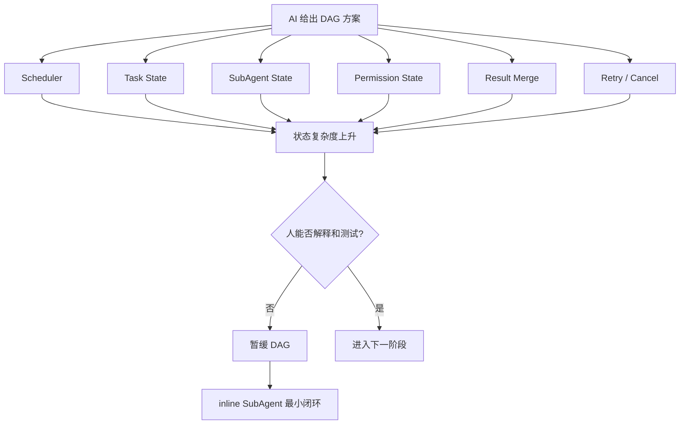

我一开始对 AI 辅助开发的期待很直接：我提出目标，AI 给我方案，最好还能顺手把代码写出来。

在 NeoCode 里做 SubAgent / DAG 方向时，我也走过这条路。我希望把复杂任务拆成 DAG，让多个子任务自动调度、自动执行、最后合并结果。这个方案听起来很完整，也很像一个“高级架构”。

但真正落地时，我很快发现自己失去了对系统的理解。

状态太复杂，模块之间衔接不起来，AI 给出的“最佳方案”看起来合理，却没有经过我自己的校验。结果是：我看不懂它到底在做什么，AI 也无法把方案正确做完，项目反而停滞了。

这次经历让我重新理解了 Human-in-the-Loop。

以前我理解 HITL，很容易把它等同于“人工审批”：AI 要执行命令了，人点一下 allow；AI 要改文件了，人点一下确认。

但现在我更愿意把它理解成：

> Human-in-the-Loop 不是让人站在旁边点一个“同意”按钮，而是让人参与 AI 开发过程中的目标定义、方案取舍、状态收敛、事实校验和完成判断。

这篇文章不是想科普一个概念，而是想记录我在 NeoCode 里踩坑之后，对“AI 时代人应该如何参与架构设计和项目实现”的一次反思。

##  Human-in-the-Loop

在做 Agent 项目之前，我对 Human-in-the-Loop 的理解其实很窄。

我以为它主要解决的是安全问题：模型要执行高风险工具，就让人确认一下；模型要访问敏感资源，就让人审批一下。

这当然是 HITL 的一部分。比如 OpenAI Agents SDK 里，当某个工具调用需要审批时，Agent run 会暂停，返回 pending approval，用户 approve / reject 后再从同一个 RunState 恢复执行。Cloudflare Agents 也把 HITL 放进 workflow approval 里：流程到审批点后暂停，客户端展示批准或拒绝，批准后带着 metadata 恢复，拒绝或超时也需要被工作流处理。

这些工程机制很重要。它们说明 HITL 不是一句口号，而是要和 pause、approve、reject、resume、state 这些真实执行状态绑定起来。

但我后来发现，如果只把 HITL 理解成“工具调用前的审批”，还是太窄了。

因为我在 NeoCode 里真正踩坑的地方，不是某一次 bash 没审批，也不是某个文件改错了，而是我在架构决策阶段没有真正进入循环。

AI 提出了方案，我接受了。  
AI 拆了模块，我相信了。  
AI 说这是最佳实践，我没有用测试和代码事实校验。  
等状态复杂到我看不懂时，项目已经很难往前推了。

那一刻我意识到：人在 AI 开发里的位置，不应该只出现在执行动作之前，而应该出现在整个系统形成判断的过程中。

## AI 不能替你形成理解

后来我看了导师对 D2A 架构公开课的总结，对这件事有了更明确的理解。

那场课表面上是用 `d2a` 工具分析 n8n 架构，实际上讲的是：AI 时代，人到底该怎么学架构。导师在总结里说，现在让 AI 很快生成一份“看起来完整”的架构文档不难，难的是把问题问对，把理解做实，把那些似懂非懂的地方追清楚。

这句话放到写代码和做项目里同样成立。

AI 很擅长给出一个看起来完整的方案。它可以迅速列出模块、状态、接口、异常处理、兜底逻辑和未来扩展。问题是：这些东西是不是真的适合当前项目？它们是不是当前阶段必须？我能不能解释它们为什么存在？它们有没有被测试验证？

如果这些问题没有人参与追问，AI 的“完整方案”很容易变成一种危险的幻觉。

D2A 里很重要的一点是，它不是让 AI 一次性生成一份架构文档就结束，而是把 human-in-the-loop 做进分析过程本身：AI 先抛出内置问题，人补充问题；AI 生成分析文档；AI 再基于文档反向出题，人回答并修正理解。导师总结里说，这不是把 HITL 当成礼貌性的确认按钮，而是把它当成分析流程本身的一部分。

这给我的启发是：好的 AI 辅助学习，不是 AI 给答案，而是 AI 不断把人拉回问题现场。

人要补充问题，回答问题，发现自己答错，重新读代码，再修正理解。

理解不是“看过答案”，而是“参与过答案怎么长出来”。

## 我接受了一个自己看不懂的“最佳方案”

回到 NeoCode。

我在 SubAgent / DAG 方向上最典型的一次教训，就是太早接受了一个自己还没有能力验证和维护的复杂方案。

一开始，DAG 看起来是很自然的方向：复杂任务可以拆成多个节点，节点之间有依赖关系，SubAgent 可以并发执行，最后再汇总结果。

AI 也很容易支持这个方向。它会告诉你应该有 Scheduler、Task Node、Worker、Result Merge、Retry、Cancel、State Store、Dependency Resolver……每个模块听起来都合理。

问题是，当我没有真正参与这些取舍时，它们很快变成了一套我自己也看不懂的系统。

为了防止失败，AI 会倾向于加更多状态、更多兜底、更多抽象、更多边界判断。表面上看，这是“防御性编程”；但在一个主链路还没跑通的项目里，它只会让架构越来越臃肿。

最后的问题不是“代码不够多”，而是“状态太多”。

Task 有状态，SubAgent 有状态，Permission 有状态，Tool Call 有状态，Run 有状态，Todo 有状态，Result Merge 也有状态。每个状态都像是为了解决一个问题而存在，但当它们叠在一起时，我已经无法清楚回答：

- 这个状态是谁创建的？
- 谁推进它？
- 谁消费它？
- 它的终态是什么？
- 它失败后怎么恢复？
- 它能不能被测试覆盖？

这就是我说的“人退出架构决策”的后果。

不是 AI 没有给方案，而是我没有真正理解方案。不是 AI 没有写代码，而是我没有用工程事实验证这些代码。不是 AI 不努力，而是我把“看起来完整”误当成了“真的可交付”。

后来我把这条线收敛到 inline SubAgent：先让主 Agent 能显式调用一个子任务，子任务在受控边界里执行，再把结构化结果回灌给主 Agent。DAG 和更复杂的编排不一定错，但不应该早于单 Agent 主链路、工具调用、权限边界、状态回灌和测试验证。

我在另一篇文章里专门复盘过这条线：[SubAgent 不是多开几个模型：NeoCode 从 DAG 试错到 inline 最小闭环的复盘](https://ca1-tang.vercel.app/blog/subagent-from-dag-to-inline)。

这次经历让我意识到：

> 复杂自动化不能早于事实、状态、权限和验收能力。

没有这些能力时，自动化只会把不确定性放大。

### HITL ：人参与目标和边界裁剪

现在我理解的 Human-in-the-Loop，第一层不是审批，而是目标和边界裁剪。

AI 时代做项目，最危险的一句话可能是：

> 帮我设计一个完整方案。

因为“完整方案”往往意味着更多模块、更多状态、更多兜底和更多抽象。但工程项目不是越完整越好，尤其是在比赛、实训、快速迭代这种场景里，真正重要的是当前阶段什么必须成立。

导师在 D2A 总结里讲架构拆解六步法，第一步就是边界分析与裁剪：先问清楚系统到底是什么、入口在哪里、砍掉 80% 代码以后什么还必须留着。

在 NeoCode 里，如果当时我能先问这些问题，DAG 线可能不会失控得那么快：

- 当前阶段必须保留的核心能力是什么？
- 我们是真的需要 DAG，还是只需要一个可控的子任务执行单元？
- 哪些功能只是看起来高级，但不是当前里程碑必须？
- 如果砍掉 80% 设计，什么仍然必须成立？
- 我能不能解释这个状态为什么存在？
- 我能不能写测试证明它有效？

这些问题不是 AI 不能回答，而是人必须参与判断。

因为架构的核心不是罗列模块，而是取舍。只要涉及取舍，人就不能退场。

### HITL 第二层：人参与架构取舍

AI 很容易把“可能有用”变成“应该实现”。

这在架构设计里尤其危险。

比如 DAG 方案里，Scheduler 可能有用，Retry 可能有用，Cancel 可能有用，Result Merge 可能有用，状态持久化也可能有用。但问题不是它们有没有用，而是：

> 当前阶段是否值得引入这些复杂度？

这就是架构取舍。

我现在会更倾向于让人和 AI 形成这样的循环：

```text
AI 提出方案
-> 人追问目标和边界
-> AI 给出多种路径
-> 人选择当前阶段可验证的路径
-> AI 落地最小闭环
-> 人用测试和事实校验
-> 再决定是否进入下一层复杂度
```

这才是我理解的 Human-in-the-Loop。

人不是每一行代码都要亲自写，也不是每个工具调用都要手动点确认。人的关键作用是：在系统出现多个方向时，做当前阶段的取舍。

对我来说，DAG 到 inline SubAgent 的收敛，就是一次典型的人机协作决策：长期看 DAG 可能有价值，但当前阶段更应该先做 inline 最小闭环。

### HITL 第三层：人参与状态收敛

DAG 让我最痛的地方，是状态复杂度。

状态复杂并不一定是坏事。一个真实系统当然会有状态。但如果人解释不了状态，系统就会变成黑箱。

我后来给自己定了一个判断标准：

> 如果人无法解释状态机，AI 生成的状态机就不应该进入核心架构。

一个状态至少要能回答：

- 它为什么存在？
- 它由谁创建？
- 它被谁推进？
- 它被谁消费？
- 它有哪些合法转移？
- 它的失败态是什么？
- 它能不能被测试覆盖？

如果这些问题答不上来，那么这个状态再“工程化”，也只是复杂度。

这也是我对 HITL 的第三层理解：人在环不是只参与“同意或拒绝”，还要参与状态收敛。

AI 可以帮我列出状态，但人要决定哪些状态进入核心模型，哪些只是实现细节，哪些暂时不该存在。

在架构设计里，状态是比模块更危险的东西。模块多了还能拆，状态乱了，系统就会变得很难推理。

下面这张图是我对当时 DAG 复杂度的简化回看：



这张图不是说 DAG 不好，而是提醒自己：如果一个架构形态还没有被人理解、测试和收敛，就不应该太早进入核心实现。

### HITL 第四层：人参与事实校验

我现在越来越认同一句话：

> Agent 的结论必须绑定 evidence，否则只是看起来很像真的解释。

在 Code Agent 项目里，最重要的 evidence 往往不是模型的自然语言解释，而是测试结果、运行日志、diff、状态变化。

尤其是测试结果。

如果 AI 说“我已经修复了”，但没有测试输出，这个完成就很虚。  
如果 AI 说“DAG 调度已经可用”，但没有一个最小任务能从创建、执行、完成、失败恢复跑通，这个架构也只是文档上的可用。  
如果 AI 说“模块已经衔接好了”，但没有一条真实链路证明数据能流过去，这个衔接就还没有发生。

这也和 D2A 总结里提到的“代码事实关联”很接近：当分析结果与代码实现不符时，要强制纠偏；若出现冲突，优先以代码为准，并可以用多模型交叉验证。

我想把这件事迁移到 AI 辅助开发里：

> 当 AI 的架构描述与测试事实冲突时，优先相信测试和代码，而不是相信自然语言解释。

所以 HITL 不是让人凭感觉判断 AI 说得对不对，而是让人追问：证据在哪里？

对不同任务来说，evidence 可以不同：

- 修 bug：复现日志 + 修复后的测试结果；
- 做功能：最小可运行链路；
- 改架构：状态机和模块衔接是否能跑通；
- 写文档：文档描述是否能对应到代码事实；
- 做 Agent：工具调用、权限、状态、结果回灌是否有可验证路径。

没有 evidence 的结论，只是自然语言上的自洽。

### HITL 第五层：人参与完成判断

AI 很容易“自我宣布完成”。

在普通问答里，这可能问题不大。但在工程项目里，项目是否完成，不应该由模型一句“已完成”决定。

完成至少要回答：

- 主链路有没有跑通？
- 是否有测试结果？
- 模块之间是否真的衔接？
- 状态是否能解释？
- 失败路径是否可处理？
- 人是否能接手维护？

这些问题是人必须参与判断的。

我以前很容易被 AI 的完成话术影响：它说已经整理好了、实现好了、接好了，我就以为事情差不多了。但后来发现，只要没有测试结果，没有最小闭环，没有可解释的状态流，它说的“完成”就不可靠。


> “我会稳稳地接住你”

所以 HITL 的最后一层，是交付验收。

人不需要替 AI 写完所有代码，但人必须判断“这件事是否真的完成”。

这也是我从 NeoCode 里学到的一个工程经验：

> AI 可以加速实现，但不能替我承担完成定义。

## 关于D2A

D2A 不只是生成文档，而是把架构分析变成一个有状态、多 Skill、可恢复的练习流程。它有外层的大 loop，也有每个分析节点内部的小 loop：AI 提问，人补充；AI 分析，人回答；人发现误解，再回到代码和文档修正。

这让我意识到，Human-in-the-Loop 的重点不是“人类是否参与了一次确认”，而是“人是否持续参与了理解的形成”。

这和我做 NeoCode 的教训是一致的。

如果人只是把 AI 当成方案生成器，项目很容易进入一种危险状态：AI 不断补复杂度，人不断被动接受，最后系统看起来越来越完整，但人越来越无法理解。

而真正有效的循环应该是：

```text
人提出目标
-> AI 给出拆解
-> 人裁剪边界
-> AI 给出实现
-> 人校验证据
-> AI 修正方案
-> 人判断完成
```

这个循环里，AI 很重要，但人不能退出。

AI 当然能提高效率。它能读代码、写草稿、生成方案、补测试、整理文档、解释错误。没有 AI，很多事情我可能根本推不动。

但 AI 越强，人越不能只做旁观者。

因为当 AI 进入架构设计和项目实现时，它不仅在写代码，也在不断替你做隐含决策：

- 要不要引入一个模块；
- 要不要新增一个状态；
- 要不要做一层抽象；
- 要不要加一个兜底；
- 要不要把当前问题推给未来扩展。

如果人不参与这些决策，就会出现我在 DAG 里遇到的问题：AI 看似在推进，实际上在扩大系统的不确定性。

所以我现在更愿意这样定义 AI 时代的开发者角色：

> 人不是每一行代码的手工劳动者，而是目标定义者、边界裁剪者、架构取舍者、证据校验者和完成判断者。

这不是降低人的价值，反而是把人的价值放到了更核心的位置。

## 人不能只是 AI 开发流程里的触发器

助教有一句话点醒我了，一个人在使用AI的过程中，不应该只作为Trigger(触发器)。

好的 Human-in-the-Loop 不是让人一直点确认，也不是把 AI 降级成只会执行命令的工具。

- 目标不清时，人要参与定义；
- 边界发散时，人要参与裁剪；
- 架构分叉时，人要参与取舍；
- 状态膨胀时，人要参与收敛；
- 结论出现时，人要追问 evidence；
- Agent 宣布完成时，人要参与验收。

人不是 AI 开发流程里的阻碍。

人是让系统不失控的关键回路。

> AI 可以帮人更快地走，但人必须决定往哪里走、为什么这样走，以及走到哪里。

（完）
