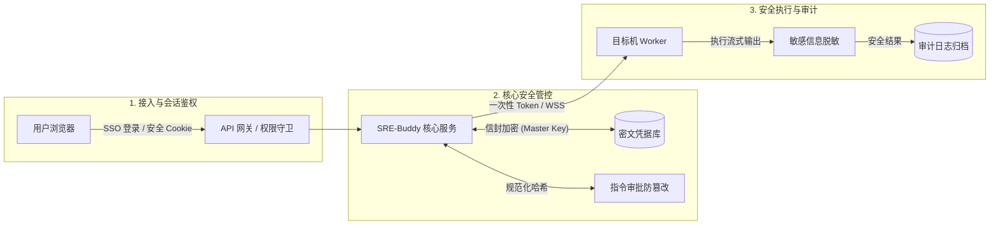
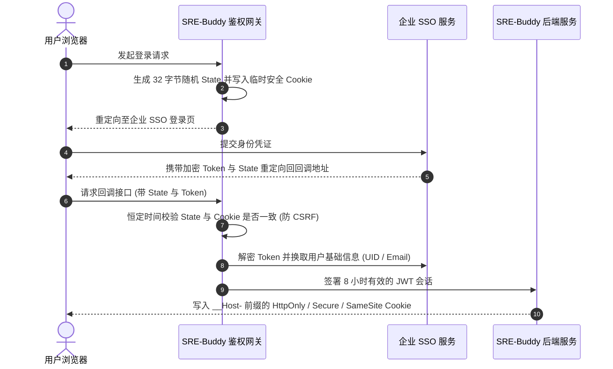
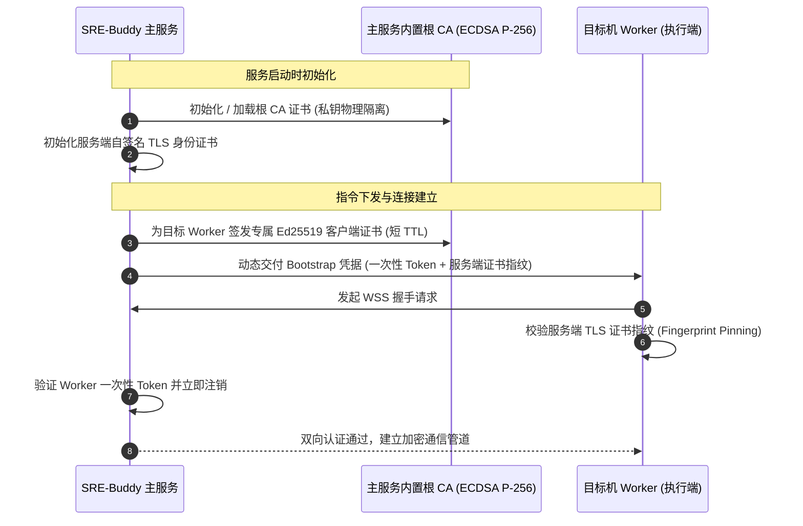
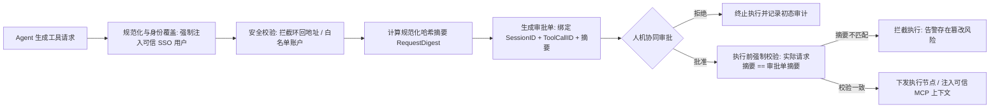
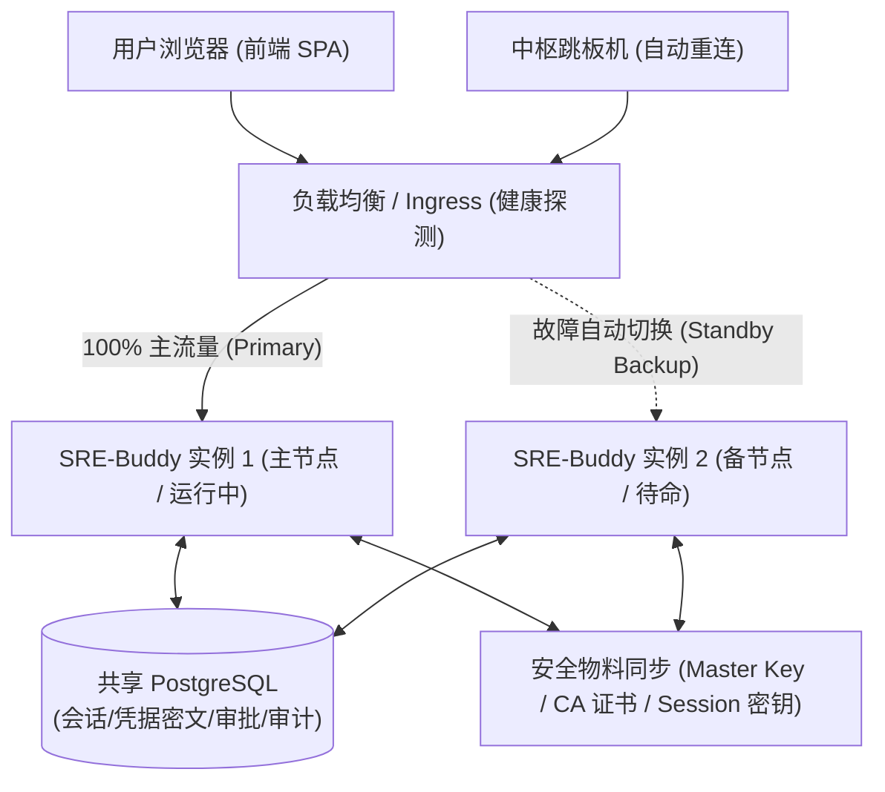

# SRE-Buddy 安全、鉴权与证书体系设计规范

> [!NOTE]
> 本规范阐述了 SRE-Buddy 在智能运维与自动化执行场景下的全链路安全架构，系统性定义了**密钥治理、身份鉴权、证书生命周期、工具执行沙箱、敏感数据脱敏、防重放机制与不可篡改审计**等核心技术规范。

---

## 一、核心设计哲学与架构总览

SRE-Buddy 针对生产环境高权限、高敏感的运维操作特征，深度践行**零信任 (Zero Trust)** 与**纵深防御 (Defense-in-Depth)** 理念，构筑覆盖数据全生命周期的多维防护屏障：

| 静态存储 (At-Rest) | 网络传输 (In-Transit) | 执行环境 (In-Execution) | 事后审计 (Audit) |
| :--- | :--- | :--- | :--- |
| • **AES-256-GCM** 密文存储 • **AAD** 变量名强绑定 | • **TLS 指纹固定** (Pinning) • **WSS** 加密通道 • **HTTP Signatures** 签名 | • **一次性高熵令牌** (Take 销毁) • **规范化哈希摘要** 审批 • **回环地址阻断** 与身份覆盖 | • **两阶段全要素** 记账 • **实时流式香农熵** 脱敏 • **多行 PEM 私钥** 自动过滤 |

### 1. 四大底层安全原则
1. **零信任校验 (Zero Trust)**：默认不信任任何非服务端计算环境及大模型输出，所有外部请求与工具调用均需经过显式鉴权与结构化合规校验。
2. **最小特权授权 (Least Privilege)**：远端执行节点采用临时、短生命周期凭据，按需动态派生且严格限定操作账户与协议边界。
3. **全链路防篡改 (Tamper-Resistance)**：命令载荷与执行上下文在审批前即固化为标准规范化哈希摘要，下发瞬间强一致比对，杜绝时序替换。
4. **全局可溯闭环 (Complete Auditability)**：所有操作与输入输出均受实时流式脱敏管道保护，并建立两阶段不可逆的操作审计账本。

### 2. 总体安全架构拓扑

---

## 二、密钥安全与信封加密体系

系统禁止在持久化存储、配置文件、控制台输出或审计日志中保留明文凭据，采用分级信封加密与内存瞬时销毁机制。

### 1. 核心认证加密与自包含密文
* **算法标准**：采用 **AES-256-GCM** 认证加密算法，同时确保密文的**保密性 (Confidentiality)** 与**完整性 (Integrity)**。
* **自包含密文格式**：
  $$\text{密文 Payload} = \text{Base64}\big(\text{Nonce}_{[12\text{B}]} \,\|\, \text{Ciphertext} \,\|\, \text{AuthTag}_{[16\text{B}]}\big)$$
  * 每次加密均由加密学安全伪随机数生成器生成独立 Nonce，杜绝重放与密钥流碰撞。
  * 解密时强制校验 16 字节认证标签，若密文遭受任意单比特篡改或破坏，解密立即报错终止。
* **安全密钥派生**：支持通过 SHA-256 算法将高熵输入材料派生为标准的 32 字节 AES 密钥。

### 2. 配置文件与环境变量的 AAD 强绑定
* **附加认证数据绑定 (AAD)**：在加密配置文件中的敏感环境变量时，强制将**变量名作为 AAD** 参与 AES-GCM 运算。
  * **安全收益**：密文与配置项名称形成强绑定。即使攻击者获取了某一低权限变量的密文，也无法将其复制替换为高权限变量的密文，从密码学层面阻断配置跨项重放漏洞。
* **主密钥物理隔离**：系统通过受控独立文件挂载 32 字节 Master Key，配置密文与解密主密钥实现存储与运维权限的物理解耦。

### 3. 用户凭据保护与内存瞬时零化
* **全字段密文落盘**：第三方系统的 API Key 与 Secret 均通过主密钥加密后持久化至数据库。
* **视图层安全脱敏**：前端查询或列表展示时自动执行掩码策略（例如仅保留前 6 位与后 4 位，中间替换为掩码字符），前端永不触碰完整明文。
* **内存生命周期管理**：解密出的临时明文对象在单次业务调用完毕后立即执行内存清空销毁，最大限度压缩明文在内存中的暴露窗口。

### 4. 规范化序列化与防时序攻击
* **标准规范化转换 (RFC 8785 JCS)**：结构化 JSON 数据在参与哈希与签名计算前，统一执行 RFC 8785 规范化处理，消除由于字段顺序、空格换行差异导致的哈希不一致。
* **常量时间算法**：所有签名比对与认证状态核验均采用恒定时间算法，彻底免疫侧信道时序攻击。

---

## 三、身份认证与会话安全

### 1. 企业 SSO 统一认证与单次 State 核销
* **高熵 State 防登录 CSRF**：
  * 发起登录时生成 32 字节高熵随机 State 并写入短生命周期（10 分钟）安全 Cookie。
  * 回调校验时通过恒定时间对比核验，且**核验通过后立即注销清除该 Cookie**，确保每个 State 仅可消费一次，防止拦截重放。
* **Token 对称解密换取身份**：回调接收到的加密凭据经解密后向企业 SSO 验证服务换取经过认证的用户邮箱与身份标识。

### 2. 安全会话与传输防护策略
* **`__Host-` 安全 Cookie 规范**：
  * 强制仅在 **HTTPS** 协议下传输。
  * 限制路径为根路径且**禁止任何子域名覆盖或篡改**。
  * 设置 `HttpOnly`（阻断 XSS 脚本窃取）与 `SameSite=Lax`（防御跨站攻击）。
* **JWT 会话时效与容差控制**：
  * 会话有效时间严格限制为 **8 小时**。
  * 引入 **30 秒时钟漂移容差 (Clock Skew)**，严格核对签发者、受众、签发时间与过期时间。

### 3. 来源安全校验 (Origin & Fetch Metadata)
* **写操作强制源校验**：所有非幂等写操作（POST / PUT / DELETE）均校验 `Origin` 与 `Referer`。
* **Fetch Metadata 拦截**：基于浏览器 `Sec-Fetch-Site` 头部，仅允许同源或同站点发起的状态变更请求，全方位阻断跨站伪造。

### 4. 基于角色的多级访问控制 (RBAC)
* **权限梯度**：区分普通用户、管理员与初始系统管理员三级权限。
* **路由守卫**：
  * 敏感管理端点（配置管理、工具注册、全量审计查询）必须具备管理员授权。
  * 数据查询默认按用户邮箱进行租户隔离，跨用户会话查询需显式获取授权。

### 5. 第三方 API 请求的 HTTP Signatures 签名
* 对接 JumpServer 堡垒机 OpenAPI 时，基于标准 HTTP Signatures 规范动态计算请求头签名：
  * 签名范围覆盖请求目标、Accept 格式及请求时间戳。
  * 采用 HMAC-SHA256 计算签名，配合远端时间窗口校验，保障报文完整性与抗重放能力。

---

## 四、证书管理与 PKI 体系

SRE-Buddy 内置轻量级证书签发中心与材料管理机制，构建服务端与远端执行节点间的双向身份鉴权与安全通道。

### 1. 内置自主 CA 与签名体系
* **根 CA 架构**：
  * 基于 **ECDSA P-256** 曲线构建自签名根 CA 证书（10 年有效期），专用于签发执行节点客户端凭据。
  * **私钥不出域原则**：根 CA 私钥严密隔离在主服务端内部，禁止任何形式的网络导出或打包。
* **短生命周期客户端证书**：
  * 基于 **Ed25519** 算法为各远端 Worker 动态签发短有效期证书，标记客户端认证用途（ClientAuth），并绑定唯一的 SHA-256 指纹。
* **服务端 TLS 身份与指纹固定 (Fingerprint Pinning)**：
  * 服务端生成基于 ECDSA P-256 的自签名 TLS 身份证书。
  * Worker 接入时通过预置指纹哈希进行比对验证，彻底消除自签名证书遭遇中间人伪造的风险。

### 2. 证书与密钥材料的原子安装与权限锁定
* **原子性安装机制**：物料文件采用“临时文件写入 ➔ 强制刷盘 ➔ 操作系统硬链接”流程落盘，杜绝多实例并发启动时的写竞争与文件损坏。
* **文件权限严格隔离**：
  * 私钥材料：权限严格锁定为 **`0600`**（仅进程属主可读写）。
  * 公钥与证书：权限设定为 **`0644`**。

---

## 五、工具执行安全与风控审批

### 1. 操作身份强制覆盖与不可伪造
* **身份剥离与受信注入**：大模型生成参数中的操作用户字段会被执行引擎**强制剥离和忽略**。
* **服务端受信派生**：操作人身份只能从当前受信任的 SSO 会话中提取真实邮箱，并由此派生堡垒机登录身份，彻底防止模型被 Prompt 注入诱导伪造高权限账户。
* **目标账户与协议白名单**：目标机登录账号限定在白名单范围（如标准业务运维账号或特权账号），传输协议强制限定为加密 SSH 方式。

### 2. 回环地址与内网穿透拦截
* **回环目标全面阻断**：参数预检阶段严格检测目标主机名与 IP，**禁止向 `localhost`、`127.0.0.1`、`::1` 或 `*.localhost` 下发命令**，从源头切断针对服务端自身、管理端口及宿主机内网服务的横向探测。

### 3. 指令防篡改摘要审批 (Human-in-the-Loop)
* **执行请求哈希绑定**：审批单生成时，对目标主机、命令内容、参数、执行上下文计算 RFC 8785 规范化摘要并固化在审批单中。
* **执行前强绑定校验**：审批通过后、指令真正下发前，系统必须重新对当前即将执行的请求计算摘要，并与审批单中的摘要进行强一致比对。
  - **安全收益**：彻底杜绝“提交安全命令审批，在批准瞬间将实际执行载荷替换为危险指令”的时序篡改攻击。

### 4. 远端 Worker 一次性启动与连接隔离
* **一次性高熵令牌 (One-Time Token)**：每个 Worker 启动前由服务端生成高熵随机令牌（默认有效时间 5 分钟）。
* **原子 Take 销毁**：Worker 首次通过 WebSocket 握手接入网关时，服务端在验证通过后**立即将其从内存注册表中注销**，杜绝令牌被截获后重放连接。
* **连接池多维隔离**：基于 `(操作用户, 登录账号, 目标主机, 端口, 通道)` 精确隔离连接池，既保障了同用户会话连接复用效率，又杜绝了跨用户、跨主机的指令串扰。

### 5. 外部 MCP 工具的不可变绑定与可信上下文
* **不可变元数据绑定**：外部工具在注册初始化时即建立不可变的工具标识映射与 Schema 参数校验器，执行阶段严格校验调用合法性。
* **可信元数据透传**：向外部工具派发调用时，由服务端自动注入认证后的上下文（会话标识、操作人邮箱、轮次、全局唯一调用 ID），确保下游工具链无法伪造调用来源。

---

## 六、敏感数据流式脱敏与安全审计

### 1. 静态与流式实时脱敏引擎
* **规则库精准匹配**：内嵌行业级规则库，覆盖各大云厂商 AccessKey、API Token、私钥、数据库密码及认证凭据。
* **香农信息熵测算 (Shannon Entropy)**：
  $$H(X) = -\sum_{i=1}^{n} P(x_i) \log_2 P(x_i)$$
  对高随机性字符串进行信息熵测算，当且仅当字符串熵值超过规则阈值时才判定为敏感密文，**大幅降低测试用例与普通词汇的误报率**。
* **流式滑动窗口与多行敏感块识别**：
  * 在指令输出流式传输至前端前，通过滑动窗口缓冲区进行实时过滤。
  * 自动识别多行 PEM 证书、RSA/OpenSSH 私钥块结构，在数据离开服务端前直接替换为脱敏标识，杜绝密钥泄露至浏览器端或审计库。

### 2. 全链路不可篡改操作审计
* **全要素结构化记录**：记录操作时间、操作人邮箱、会话标识、工具调用标识、目标主机、执行命令、执行原因、审批状态、执行耗时及脱敏后的执行摘要。
* **两阶段审计记账**：指令下发前记录起始状态，执行完成后追加耗时与结果摘要，形成完整的不可篡改审计追踪链。

---

## 七、防重放与幂等性保障机制

系统在用户认证、凭据配置、证书初始化到指令下发执行全链路中实施了严格的**防重放 (Anti-Replay)** 与**幂等性 (Idempotency)** 约束。

### 1. 防重放保障矩阵
| 业务场景 | 防重放技术手段 | 核心防范目标 |
| :--- | :--- | :--- |
| **SSO 身份认证** | 32 字节高熵 State + 校验后立即注销清除 | 阻断登录 CSRF 伪造与历史 State 拦截重放 |
| **Worker 远端接入** | 5 分钟有效高熵 Token（原子 Take 消费销毁） | 杜绝 Worker 启动凭据泄露后的二次重放接入 |
| **配置信封密文** | AES-256-GCM + 配置变量名作为 AAD 强绑定 | 杜绝配置密文跨项复制替换与降权重放 |
| **命令审批执行** | RFC 8785 规范化摘要 (`RequestDigest`) 强校验 | 阻断命令时序替换篡改与跨会话指令重放 |
| **外部 API 调用** | HTTP Signatures 绑定 Date 时间戳 | 丢弃超时请求，防止截获历史报文实施重放 |

### 2. 幂等性保障矩阵
| 业务场景 | 幂等性技术手段 | 核心保障收益 |
| :--- | :--- | :--- |
| **证书与密钥生成** | 优先加载合法配对 + 原子硬链接落盘 | 保证多实例并发启动/重启时证书不被覆盖损坏 |
| **配置文件更新** | 变量名精准扫描 + 原地原子替换 (Dotenv Upsert) | 保证任意多次配置变更最终文件只保留唯一定义 |
| **用户凭据管理** | 增量继承合并 + 全字段加密覆盖 | 重复提交相同凭据保持系统状态确定性一致 |

---

## 八、主备高可用与多实例安全对齐机制

为了满足企业级运维系统 99.99% 的高可用 (HA) 与故障容灾目标，SRE-Buddy 支持主备热备（Active-Standby）与多实例无状态水平扩展架构。在跨实例调度与故障转移（Failover）过程中，必须严格保障安全体系的一致性与无感切换。

### 1. 跨实例核心安全物料对齐矩阵
跨实例部署时，以下安全物料必须在多节点间保持严格的二进制或哈希一致，否则会导致切换时业务中断或鉴权失败：

| 安全物料 | 对齐要求与一致性策略 | 不一致时的故障风险 |
| :--- | :--- | :--- |
| **主密钥 (Master Key)** | 双机必须挂载完全相同的 32 字节 Master Key 文件 | 备节点接管后无法解密数据库中由主节点加密持久化的 JumpServer 凭据 |
| **SSO 会话签名密钥** | 双机必须配置完全一致的 JWT 签名密钥与对称解密密钥 | 故障切换后，用户浏览器中的 Session Cookie 验签失败，导致在线排障工程师被强制登出 |
| **根 CA 与 TLS 身份证书** | 根 CA 私钥与服务端自签名 TLS 证书物料必须跨节点同步 | Worker 探针由于**指纹固定 (Pinning)** 不匹配判定遭遇中间人伪造，拒绝与备节点建联 |
| **持久化审计与审批库** | 必须共享同一个高可用关系型数据库实例 | 审批状态与全生命周期审计记录跨机断档，破坏合规审计链条 |

### 2. 故障转移 (Failover) 下的会话与鉴权连续性
- **无感身份续约**：
  - 用户浏览器持有标准的 JWT 会话 Cookie，由于双机共享相同的验签密钥与有效期规则，主节点宕机后，流量被负载均衡秒级切至备节点，用户**完全无需重新登录**。
- **凭据解密即时生效**：
  - 备节点直接读取共享数据库中的 AES-256-GCM 密文，并使用对齐的 Master Key 动态解密并完成 JumpServer API 签名调用。

### 3. 反向长连接与 Worker 探针的容灾重连治理
- **跳板机反向链路断线重连**：
  - 中枢跳板机探针内置指数退避自动重连机制。当主节点故障导致 WebSocket 断开时，跳板机探针秒级重新向负载均衡发起建联，流量平滑路由至备节点并完成握手注册。
- **Worker 启动令牌的跨机状态保护**：
  - 主备模式下，每个实例的临时 Token 均在其独立的内存注册表中进行原子核销；
  - 任务发生故障转移时，未完成的旧任务被标记终止，备节点接管后为新发起的诊断轮次生成专属的新一代高熵 Token，杜绝跨机状态悬挂与重放利用。

### 4. 多实例共享状态与防并发互斥机制
- **会话并发互斥锁**：
  - 在全活集群或并发多调度场景下，利用数据库级**咨询锁 (Advisory Lock)** 锁定特定会话标识，防止同一会话被不同节点并发调度导致时序混乱或脏写。
- **审批决议的原子条件更新**：
  - 审批单决议操作采用原子条件更新（仅当状态为待审批时方可更新），防止多节点或多管理员并发决策产生的脑裂与状态冲突。

---

## 九、安全配置与部署规范对照表

| 领域 | 安全规范与配置要求 | 风险防范目标 |
| :--- | :--- | :--- |
| **主密钥管理** | 部署独立的 32 字节二进制主密钥文件，多实例节点间必须严格对齐 | 防止数据库泄露导致凭据全面失陷，保障主备切换解密连续 |
| **配置信封保护** | 生产环境敏感变量强制使用带变量名 AAD 绑定的信封密文 | 防止配置明文泄露与密文跨变量替换重放 |
| **Cookie 策略** | 生产环境必须开启 `__Host-` 前缀、HTTPS 传输与 SameSite=Lax | 抵御 XSS 窃取与跨站请求伪造 (CSRF) |
| **会话时效** | JWT 签名有效时长为 8 小时，时钟容差限制在 30 秒内，双机密钥对齐 | 限制凭据泄露窗口，保障过期失效与主备无感切换 |
| **证书私钥控制** | 根 CA 私钥严禁打包导出，物料文件权限强制锁定为 `0600`，双机对齐 | 防止私钥泄露，保障 Worker 指纹固定跨节点校验通过 |
| **执行审批校验** | 执行前必须验证执行请求与审批单规范化哈希的一致性 | 防止审批通过后的指令被中间环节时序篡改 |
| **接入令牌控制** | 远端 Worker 启动凭据采用一次性高熵令牌（原子 Take 核销） | 彻底防止 Worker 启动令牌的二次重放连接 |
| **回环地址拦截** | 目标机参数校验严格阻断 `localhost`、`127.0.0.1` 及子域名 | 防止内部管理端口或宿主机内网被横向探测 |
| **物料原子落盘** | 证书与密钥文件通过原子硬链接落盘，存在即复用 | 保证多实例并发启动/重启的强幂等与零文件损坏 |
| **实时流脱敏** | 目标机执行输出在推送到前端前必须经过流式脱敏管道 | 防止私钥、密码在终端界面或历史记录中暴露 |
| **主备状态治理** | 采用共享数据库咨询锁与审批原子条件更新 | 消除多实例并发操作时的脑裂、竞态与脏写风险 |
