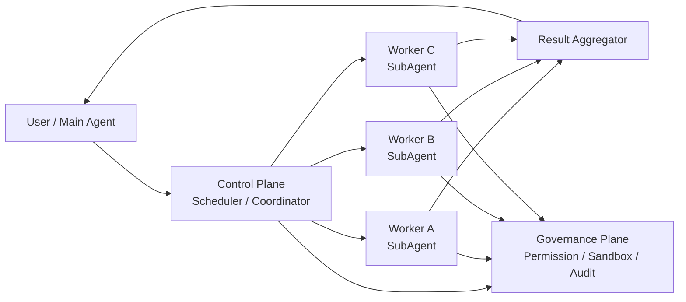
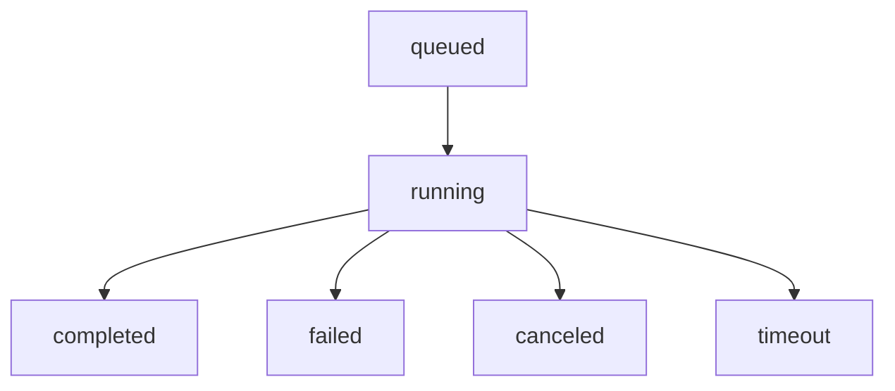

我最近在实训项目里实现 code agent 的 SubAgent 能力，项目地址：  
[1024XEngineer/neo-code](https://github.com/1024XEngineer/neo-code)

这篇我不只做“踩坑叙事”，而是按技术主线完整讲一遍：

- SubAgent 到底是什么，和任务编排是什么关系
- `inline`、`fork`、`coordinator` 三种模式怎么选
- 我为什么从 DAG 主路径切回顺序 Todo + inline
- 下一阶段怎么从“稳定闭环”升级到“可控并发”

我会保留工程反思，但重点放在可复用的架构设计上。

---

## 1. 先定义问题：我们为什么需要 SubAgent

最早做 SubAgent，不是为了“多开几个 agent 看起来很酷”，而是为了解这几个实问题：

- 主代理上下文越来越脏，历史消息挤压当前任务
- 长链路 ReAct 循环稳定性下降，容易偏题
- 不同任务（检索、改码、验证）混在同一上下文里互相污染
- 复杂任务需要拆解，但拆了以后没有稳定执行容器

所以我把 SubAgent 定义成：

> **在主循环之外，承接“单一子任务”的受控执行单元。**

关键词是“受控”：

- 受控输入（任务切片，不继承全量历史）
- 受控能力（工具和路径白名单）
- 受控输出（结构化回灌，不是聊天转储）
- 受控生命周期（可观测、可中断、可归档）

---

## 2. SubAgent 不是一个功能点，而是三层架构

我现在把它拆成 3 层看，会清晰很多：

1. **执行层（Worker）**  
负责“把一个任务做完”，不要管全局编排
2. **控制层（Coordinator / Scheduler）**  
负责“决定谁做、何时做、失败怎么办”
3. **治理层（Policy / Permission / Sandbox / Audit）**  
负责“允许做什么、做到什么边界、怎么追责”



只要你把这三层揉在一起，就会回到“主循环越来越重、问题越来越难定位”的老路。

---

## 3. 三种模式：inline / fork / coordinator

这部分是我后来看清楚的关键。SubAgent 不止一种执行模式。

| 模式 | 核心特征 | 优点 | 风险/成本 | 适用阶段 |
|---|---|---|---|---|
| `inline` | 主代理显式调用，子任务同步闭环 | 语义清晰、可观测强、实现简单 | 吞吐有限 | 早期到中期，先打稳定 |
| `fork` | 从共享前缀派生并行执行 | 并行效率高，token 复用潜力大 | 上下文一致性和冲突治理复杂 | 有稳定主链路后 |
| `coordinator` | 中心化编排，协调者与工作者分权 | 复杂任务可扩展，组织结构清晰 | 编排、恢复、审计系统都要补齐 | 后期企业级编排 |

我的项目转向，本质上就是：

> 在治理层和控制层还不够稳时，优先 `inline`，延后 `fork/coordinator` 主路径。

---

## 4. 我的路线变化：从 DAG 主路径回到顺序 + inline

起点（Epic #273）是典型多代理内核路线：

- 任务图（Task DAG）
- 调度并发
- WorkerRuntime 角色化
- 能力继承隔离
- 可恢复执行和事件流

这条路线没有错，但我在落地时碰到了工程现实：

1. **状态一致性成本陡增**  
任务状态、Todo 状态、工具状态、权限状态并行演化，转移矩阵爆炸
2. **可观测性不够时，排障成本指数上涨**  
“看起来跑了”和“实际完成”之间存在语义断层
3. **失败恢复策略容易黑盒化**  
重试、取消、超时、回滚谁拍板，边界不清就会互相覆盖
4. **团队协作心智负担过高**  
不是代码写不出来，而是难以保证全员对运行语义一致理解

于是我做了 #364 / #365 的转向：

- 主路径不依赖 DAG 自动派发
- 顺序 Todo 执行
- 需要子任务时显式 `spawn_subagent(mode=inline)`
- 结果即时回灌并继续主循环

这不是“技术降级”，是控制变量。

### 4.1 会议里两句让我真正转向的话

这次转向不只是我自己“想明白了”，也是被团队讨论敲出来的。

许总和飞龙老师给我的提醒，我后来总结成三条和 SubAgent 强相关的工程规则：

1. **先把单循环闭环做稳，再谈并发编排**  
如果单会话链路还不稳定（工作区隔离、状态约束、错误回灌都没打稳），并发会先放大不确定性，不会先放大产出。

2. **工具链完备性优先于复杂调度能力**  
在 coding agent 里，`read/write/edit + bash + Git + 判定工具` 是基础设施。  
这些没稳之前，DAG/Coordinator 再漂亮也容易成为“调度一个不稳定系统”。

3. **任务拆解是本质，DAG 只是表达手段**  
DAG 的价值是承载依赖，不是替你决定架构优先级。  
要先回答任务为什么拆、拆到什么粒度、如何验收，再决定是否上 DAG 和并发。

这三条直接影响了我的实现策略：先收敛主路径，再分阶段拿回并发。

---

## 5. `spawn_subagent(mode=inline)` 的执行链路

在我的实现里，`spawn_subagent` 是**显式工具**，不是 Todo 元数据触发器。

```text
Main Agent decide subtask
-> spawn_subagent tool call
-> tool schema validation
-> build SubAgentRunInput
-> SubAgentInvoker (runtime injected)
-> resolveInlineSubAgentCapability
-> RunSubAgentTask
-> SubAgentRunResult
-> structured ToolResult
-> main loop continues
```

关键原则：

1. 子代理仍在 runtime 治理之内，不绕过主安全链路  
2. 工具层只做参数和协议，执行层拍板在 runtime  
3. 主代理是最终决策者，子代理是受控执行者

---

## 6. 上下文与输出治理：防污染是第一优先级

我实际踩坑后，形成了四道防线。

### 6.1 输入限幅

- prompt / arguments / allowlist 限长度和数量
- 拒绝把父级全量历史“偷渡”进子任务

### 6.2 上下文切片

- 子代理只拿任务目标、必要依赖和验收条件
- 不继承主代理完整消息历史

### 6.3 结构化回灌

- 回灌的是固定字段，不是完整聊天转储
- 主代理消费的是“结果对象”，不是“自由文本洪水”

### 6.4 错误分类

- timeout / canceled / contract_violation / permission_denied 分开处理
- 让主代理和上层 UI 都能做确定性分支，不靠猜

---

## 7. 权限继承：子代理不能高于父代理

这是我最不妥协的边界。

权限收敛原则：

```text
child_capability = parent_capability ∩ child_requested_capability
```

包括两类核心资源：

- `allowed_tools`
- `allowed_paths`

任何越权请求直接拒绝。  
这会牺牲一点灵活性，但换来“系统边界可证明”。

---

## 8. 终态与事件流：没有可观测性就没有可维护性

我现在至少保证这组最小事件集合：

- `subagent_started`
- `subagent_step` / `subagent_tool_call_started`
- `subagent_tool_result`
- `subagent_completed`
- `subagent_failed`
- `subagent_canceled`
- `subagent_timeout`

终态判定建议：



这看起来简单，但决定了重试、补偿、UI 展示和审计逻辑是否一致。

---

## 9. 我现在对“编排层”的后续设计（脱离当前项目也适用）

如果不绑死当前代码，我会按下面的演进路线做。

### Phase A：稳定 inline（已验证）

- 明确能力收敛
- 明确终态语义
- 明确结构化回灌

### Phase B：bounded queue（可控并发）

- 每个主会话维护子任务队列
- `max_concurrent` 从 1 到 2/3 逐步放量
- 支持取消传播、退避重试、幂等回写
- 明确“进入条件”：单会话闭环稳定、Git 与判定工具已进入主链路

### Phase C：coordinator 模式（中心化编排）

- 协调者只负责编排，不直接改代码
- 工作者只负责执行，不做全局决策
- 引入统一任务契约（TaskSpec / Budget / Capability / ResultSchema）
- 增加编排审计（谁创建、谁取消、为何重试）
- 增加“退出条件”：任务可复现、失败可定位、状态可恢复

目标不是“一步到位做企业平台”，而是每一步都可验证、可回滚。

---

## 10. 工程复盘：我会坚持的三条规则

1. **先定义业务问题，再定义架构形态**  
不是先问“要不要 DAG”，而是先问“当前最小闭环要解决什么”

2. **先打稳单循环，再扩大并发半径**  
单会话不稳时谈并发，通常只是把问题并行放大

3. **复杂决策必须团队共识，不一人拍板**  
架构不是个人作品，是团队长期维护对象

补一句我这次最实在的收获：  
**“先实现”在原型期是效率，但在高复杂度系统里，常常会变成返工债。**  
SubAgent 这种高耦合模块（和 Todo、Scheduler、Tool、Safety、Git 都有关系）尤其如此。

---

## 结语

如果你正在做 SubAgent，我的建议不是“别做并发”，而是：

> 先把 `inline` 做成可靠执行单元，再把它升级成可控并发编排系统。

这次路线从 DAG 主路径收敛到顺序 + inline，看起来像后退，  
但它带来的其实是一个更强的前提：**主链路稳定、边界清晰、系统可演进。**

这也是我现在最认同的一句话：

> **先在脑子里跑通工程，再在代码里跑通系统；先做可交付，再做可炫耀。**

---

## References

- [Issue #273: SubAgent Epic](https://github.com/1024XEngineer/neo-code/issues/273)
- [Issue #364: 顺序 Todo + inline 收敛](https://github.com/1024XEngineer/neo-code/issues/364)
- [PR #365: 执行模型切换落地](https://github.com/1024XEngineer/neo-code/pull/365)
- [Claude Code Book 第9章：子智能体与 Fork 模式](https://github.com/lintsinghua/claude-code-book/blob/main/%E7%AC%AC%E4%B8%89%E9%83%A8%E5%88%86-%E9%AB%98%E7%BA%A7%E6%A8%A1%E5%BC%8F%E7%AF%87/09-%E5%AD%90%E6%99%BA%E8%83%BD%E4%BD%93%E4%B8%8EFork%E6%A8%A1%E5%BC%8F.md)
- [Claude Code Book 第10章：协调器模式-多智能体编排](https://github.com/lintsinghua/claude-code-book/blob/main/%E7%AC%AC%E4%B8%89%E9%83%A8%E5%88%86-%E9%AB%98%E7%BA%A7%E6%A8%A1%E5%BC%8F%E7%AF%87/10-%E5%8D%8F%E8%B0%83%E5%99%A8%E6%A8%A1%E5%BC%8F-%E5%A4%9A%E6%99%BA%E8%83%BD%E4%BD%93%E7%BC%96%E6%8E%92.md)
